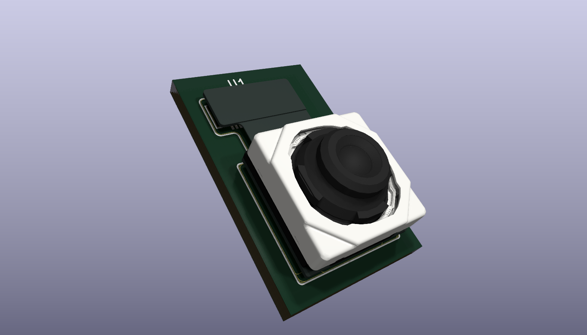
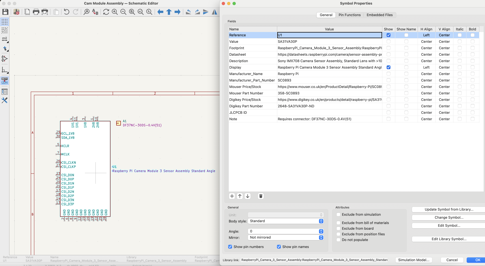
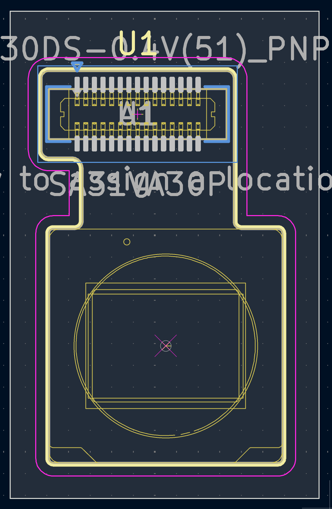

# Raspberry Pi Camera Module 3 Sensor Assembly

KiCad library files for using the Raspberry Pi Camera Module 3 sensor assembly as a board-level component in a custom design.

Schematic symbol available in Standard Kicad Library Convention (Mostly) Compliant Format, and by selecting Alternate representation, in Connector layout format.
- 4 symbols, for each SKU available with Mouser, and Digikey Bill of Materials + a 5th Connector Assembly Symbol and Pick and Place Footprint.
- You should place a Camera Module symbol on your schematic, and the connector DF37 etc. with refdes prefix A, then align the Pick and Place Footprint to the Camera Module Footprint.

Schematic should look similar to:

PCB footprint available with specific 3D models for Standard and Wide Angle Camera Assemblies matching each symbol. They have been created in a KiCad Library Compliant Style.
- The male PCB connector is included with the Pick and Place Footprint DF37 etc.
- There is a KiCad rendering issue with the thin housing for the Wide Angle Sensor, that is not present in Fusion 360.
- The 3D models are the Raspberry Pi Limited provided models, and are therefore ©️ Raspberry Pi Limited.

PCB should look similar to:

## Contents

| Path | Description |
| --- | --- |
| `RaspberryPi_Camera_Module_3_Sensor_Assembly.kicad_sym` | Schematic symbol for the sensor assembly and board to board connector for pick and place |
| `RaspberryPi_Camera_Module_3_Sensor_Assembly.pretty/` | PCB footprints for the 30-pin board-to-board connector and Camera Module sensor assembly outline |
| `RaspberryPi_Camera_Module_3_Sensor_Assembly.3dshapes/` | STEP model with coloured texture of the Camera Module 3 sensor assembly with additional Fusion 360 editable files provided |

