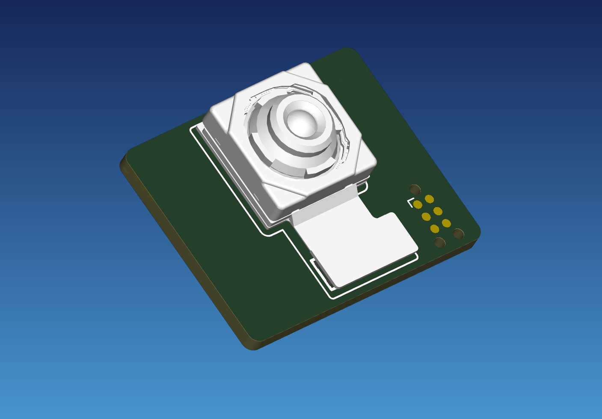

# Raspberry Pi Camera Module 3 Sensor Assembly

KiCad library files for using the Raspberry Pi Camera Module 3 sensor assembly as a board-level component in a custom design.

## Contents

| Path | Description |
| --- | --- |
| `Raspberry_Pi_Camera_Module_3_Sensor_Assembly.kicad_sym` | Schematic symbol for the sensor assembly |
| `Raspberry_Pi_Camera_Module_3_Sensor_Assembly.pretty/` | PCB footprint for the 30-pin board-to-board connector and assembly outline |
| `Raspberry_Pi_Camera_3_Sensor_Assembly.3dshapes/` | Simplified STEP model of the Camera Module 3 sensor assembly |

## 3D model

The footprint embeds `Camera_module_3_std_model_simple.stp`, so the sensor assembly should appear automatically in KiCad's 3D Viewer when the footprint and model are kept together as provided.
